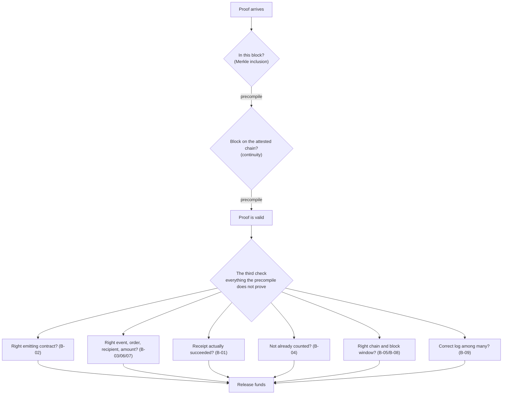

<div align="center">


# ThirdCheck

**A valid Attestcoin proof tells you a transaction happened. It never tells you it is the transaction your contract meant to act on. That gap is the third check, and it is where cross-chain money leaks.**

ThirdCheck is a security bench, a static analyzer, and a CI gate for that gap.


BUIDL CTC 2026 Fall · Creditcoin & Credit Labs · DeFi track

</div>

---

## Watch the demo

**[Watch the 1:53 demo](https://youtu.be/kQkfFFNlvFA)** — the sticky line is the whole thesis: *the proof is real, the payment is wrong.*

A real proof that released a payment that never happened, the falsifier (a naive escrow releases, the hardened one rejects), the twelve checks collapsed to two calls, the settlement rail, and a tampered proof failing a check on camera before the real one passes 11/11. Everything on screen is real and on-chain, on public testnets; every claim is reproducible with `npm run judge:verify`.

---

## The gap, in one picture

The BlockProver precompile at `0x0FD2` answers two questions and stops. Everything below the line is left to the developer, and a proof that passes the precompile says nothing about any of it.



A consumer that treats "the proof is valid" as permission to release funds ships a bug. ThirdCheck builds legitimate proofs of the wrong thing, shows which consumers pay out against them, and ships the fix.

## Verify it yourself

No private key, no funded account, no waiting for attestation. One command reads the committed evidence and re-confirms it live against the public CC3 testnet:

```bash
git clone https://github.com/kasbsquall/thirdcheck && cd thirdcheck && npm install
npm run judge:verify
```

It checks, independently:

- **on-chain** the vulnerable escrow's releases are real mined CC3 transactions, and the B-09 contrast is a clean pair on the same proof: vulnerable releases, hardened reverts.
- **protocol, live** a keyless `eth_call` to `0x0FD2` shows the precompile replies `Unknown selector` to `verifySingle` (an SDK helper name, not an on-chain selector) while it dispatches the real `verify`.
- **findings** three source-confirmed defects of three distinct classes across the public field, each re-derivable from source. Names are withheld here pending coordinated disclosure.
- **scorecard** the field scorecard's own invariants hold: the submission set reconciles and the distributions are sound.
- **protocol surface** the conformance run exercised 15 of the 16 precompile entry points, against a typical consumer's one.

The protocol-surface map is its own read-only command:

```bash
npm run conformance
```

## The catalogue

Twelve binding checks the precompile leaves to the developer. Each has a stable id, a detection method, and the attack it enables.

| id | the check that is missing | the attack it enables | detected by |
|---|---|---|---|
| B-01 | receipt status not read | a reverted source payment counts as a real one | bench |
| B-02 | emitting contract not pinned | a look-alike contract forges the event | bench + analyzer |
| B-03 | event signature not checked | an unrelated event is read as a payment | documented |
| B-04 | no replay guard on the proof | one real payment is spent many times | bench |
| B-05 | chain identity not checked | a proof from another chain is accepted | documented |
| B-06 | proven tx not bound to the order | a real payment for order X releases order Y | bench |
| B-07 | payer, recipient, amount not bound | a smaller or misdirected payment releases the full order | documented |
| B-08 | block window not constrained | a stale or premature block is accepted | documented |
| B-09 | only the first log read | a decoy log in the same receipt wins | bench |
| B-10 | acts before the frontier advances | a promise the protocol cannot keep (measured lag ~8 min) | analyzer |
| B-11 | verifier swappable, or a non-existent selector | verification that never runs, or is owner-controlled | analyzer |
| B-12 | off-chain failure read as a negative | a dead RPC becomes a "proven absence" | analyzer |

## What is in the box

| piece | path | what it is |
|---|---|---|
| Falsifier | `src/bench.ts` | five dynamic attacks that submit legitimate proofs of the wrong thing, plus a positive path |
| Static analyzer | `src/engine.ts`, `src/static.ts` | catches source-visible defects with file:line evidence; strips comments first, so a guard described in a comment cannot stand in for one missing from the code |
| Vulnerable escrow | `contracts/cc3/VulnerableEscrow.sol` | the target: verifies against the real precompile, checks the event signature, and still releases against a forgery because it never binds the proof to the order |
| Hardened escrow | `contracts/cc3/HardenedEscrow.sol` | the same escrow with the checks in a fixed order; rejects every attack, releases the correct payment, deployed on CC3 |
| The third check, as a library | `packages/thirdcheck-contracts` | the hardened logic as an installable Solidity library: `verifyReceipt` + `bindPayment` give a consumer all twelve checks in two calls |
| Example consumer | `contracts/cc3/SettlementConsumer.sol` | a complete, correct cross-chain escrow in ~40 lines, built on the library |
| CI gate | `action.yml` | a GitHub Action that fails a build before mainnet if a consumer skips the third check |
| Template repo | `examples/settlement-consumer-template` | a forkable project that passes the gate on day one |
| Settlement rails | `contracts/protocol/SettlementHub.sol` | shared cross-chain settlement any dApp routes value through, third-check-correct by construction, with a hard-capped protocol fee |
| Trust registry | `contracts/protocol/VerifiedRegistry.sol` | an on-chain record that a consumer passed the third check, bound to its code hash; verified operators settle at a lower fee |
| Live checker | `frontend/` | paste any contract or a GitHub repo URL and get the same verdict the gate gives |

## Ship a correct consumer

Finding the bug is half of it. The other half is making the right thing easy. The audited logic of the hardened escrow is packaged as a library, so a new consumer gets all twelve checks in two calls instead of reimplementing them and getting one wrong:

```bash
npm install thirdcheck-contracts @gluwa/usc-contracts
```

```solidity
import { ThirdCheckLib } from "thirdcheck-contracts/contracts/ThirdCheckLib.sol";

// chain identity, block window, inclusion+continuity, replay, receipt status:
EvmV1Decoder.ReceiptFields memory receipt = ThirdCheckLib.verifyReceipt(
    consumedProof, order.expectedChainKey, order.minHeight, order.maxHeight,
    chainKey, height, encodedTransaction, merkleProof, continuityProof
);
// emitter, event signature, correct-log selection, order, recipient, amount:
ThirdCheckLib.bindPayment(receipt, order.expectedSource, orderId, order.seller, order.amount);
```

`contracts/cc3/SettlementConsumer.sol` is a full working escrow built exactly this way.

## Use it in CI

ThirdCheck ships as a GitHub Action. Any Attestcoin integrator wires the gate into CI with one line, and fails the build before mainnet if a consumer skips the third check:

```yaml
- uses: actions/checkout@v4
- uses: kasbsquall/thirdcheck@v1
  with:
    path: contracts      # directory to scan (default ".")
    fail-on: confirmed   # or "any" to also fail on review-class findings
```

The gate posts inline PR annotations and exits non-zero on a defect-class finding: a verify path that cannot reach the precompile, a swappable verifier, a proof replaced by a signature, or an off-chain generator that blanks a proof yet reports success. Authorized-caller roles, write-once setters, and test mocks are distinguished, so the gate does not cry wolf. This repo runs the gate on itself. A copy-paste workflow is in [`examples/consumer-workflow.yml`](examples/consumer-workflow.yml), and a forkable consumer that passes on day one is in [`examples/settlement-consumer-template/`](examples/settlement-consumer-template/).

## The field

ThirdCheck reviewed the public BUIDL CTC field. The analyzer raised dozens of flags; a flag is a lead, not a verdict, so every production signal was read by hand. The review stands behind three source-confirmed defects of three distinct classes:

1. a consumer whose on-chain verification cannot reach the real precompile, because it calls a selector the precompile does not implement, with a second path that bypasses verification entirely.
2. a consumer that replaces the protocol's inclusion and continuity proof with a single centralized `ecrecover` signature, reducing the whole guarantee to one owner-controlled key.
3. a consumer whose on-chain "verify and record" function discards the proof, calls no precompile, and writes a forgeable payment record from unauthenticated caller data.

Names are withheld from this repository pending coordinated disclosure. The teams and the sponsor receive the full write-ups privately first; nothing is named publicly until a team acknowledges or a 14-day window passes. The full basis is available to the sponsor on request.

## How the Attestcoin protocol is used

Attestcoin is the subject here, not a component. ThirdCheck exercises the real protocol end to end, on real testnets, from three directions:

1. **It generates real proofs.** `src/proof.ts` uses `@gluwa/usc-sdk` to wait for a Sepolia block to cross the CC3 attestation frontier, then fetches Merkle and continuity proofs from the prover. Every attack submits a genuine proof the precompile accepts.
2. **It calls the precompile the way a consumer does.** Both escrows call `verifyAndEmit` at `0x0FD2` through the official `@gluwa/usc-contracts` interface, in the same transaction as the state change, and decode the proven transaction with the official `EvmV1Decoder`. The hardened escrow keys its replay guard on `calculateTxIndex`, the on-chain-recovered transaction position, not a caller-supplied value.
3. **It measures the protocol honestly.** `scripts/check-setup.ts` reads the ChainInfo precompile at `0x0FD3` and the live attestation frontier. Measured lag from Sepolia to CC3 was about 8 minutes, which is why any consumer promising real-time reaction is making a promise the protocol cannot keep.

One correction was needed to build this: the precompile's real surface is `verify` and `verifyAndEmit` (single and batch) plus `calculateTxIndex`. `verifySingle` and `verifyBatch` are SDK method names, not on-chain selectors, so a contract that declares them against `0x0FD2` cannot reach the real precompile. That is catalogue entry B-11, and the analyzer flags it automatically.

## Why this is a Creditcoin ecosystem bet

Track: DeFi. ThirdCheck is the safety layer for cross-chain DeFi settlement on Attestcoin, and it ships a working settlement primitive, `SettlementConsumer`, that any lending, trading, or RWA app can build on.

The precompile is what makes cross-chain value flow possible on Creditcoin. Every unit of value that moves through it depends on a consumer getting the third check right, and the field review shows most do not. That unaddressed risk is the ceiling on how much value the ecosystem can safely carry. ThirdCheck removes it from three sides: the analyzer and CI gate stop the bug before mainnet, the library ships the correct implementation as a two-call dependency, and the bench proves the difference with real on-chain transactions.

The wedge is to be the default pre-mainnet gate for every Attestcoin consumer, the way a linter or a test suite is default rather than optional. From there the path is to be the security layer of the ecosystem: continuous CI verification, runtime monitoring of deployed consumers, and audit-grade review, offered as a service while the gate and the library stay free and drive adoption. The flywheel is direct. Safer consumers let Creditcoin carry more cross-chain value, which pulls in more builders and more value, and each new consumer needs the third check. ThirdCheck grows as the ecosystem it protects grows.

### The protocol: rails and a trust registry

Two contracts turn that thesis into value that flows on-chain, both deployed on CC3 testnet:

- **SettlementHub** is shared settlement rails. Any dApp opens an order and settles it against a source-chain payment proof; the hub runs the whole third check by construction (the audited `ThirdCheckLib` path) and takes a hard-capped protocol fee on release. The protocol captures a slice of the cross-chain value it makes safe to move.
- **VerifiedRegistry** is the trust layer. It records that a consumer passed the third check, bound to the consumer's code hash so the badge cannot outlive the code it was granted for. The `ConsumerVerified` event is an ordinary log, so any other Attestcoin chain can consume it by verifying it through the BlockProver precompile, the same primitive ThirdCheck uses everywhere.

The two are linked so that being provably safe is cheaper than not being: a verified operator settles at a lower fee. That link is live and keyless to check. `npm run judge:verify` reads the deployed contracts and confirms a verified operator is quoted 0.10% against an unverified operator's 0.25% on the same amount.

The rails are not only deployed, they have settled a real order end to end, between three distinct addresses. An external operator paid on Sepolia through `SourceSettlement`, opened and funded the matching order on the hub on CC3, and once the source block crossed the attestation frontier the hub's `settle` ran the full third check, took the protocol fee, and paid the seller. Both transactions are public:

| step | chain | transaction |
|---|---|---|
| source payment | Ethereum Sepolia | [`0x94d9d06b…67399c`](https://sepolia.etherscan.io/tx/0x94d9d06bbe1c6478a76ec4112a6b2edd17fb7ca1ec7b14f46db981d66e67399c) |
| settlement | Creditcoin CC3 | [`0x58e18e7c…c9d597`](https://creditcoin-testnet.blockscout.com/tx/0x58e18e7c41659bb4a2b6d000ee7f8fa18fa37a3ff37bf89819b68a43cfc9d597) |

Operator, seller and treasury are three distinct addresses. The settlement paid 0.0009975 to the seller and captured 0.0000025 as the protocol fee, the 0.25% quoted for an unverified operator, and both deltas landed on-chain. These are testnet transactions with self-custodied demo keys. `judge:verify` reads the mined `settle` transaction off the public RPC and confirms the order is released, the three parties are distinct, and the fee was taken.

## Deployed addresses (testnet)

| contract | chain | address |
|---|---|---|
| SourceSettlement | Ethereum Sepolia | `0xD8504B263104aa915974eCCE1002d7F7587e88cD` |
| ImpostorSettlement | Ethereum Sepolia | `0x327c38893Dd70ACCEC5Dc5F5CD5558f6ab33032a` |
| VulnerableEscrow | Creditcoin CC3 | `0xD8504B263104aa915974eCCE1002d7F7587e88cD` |
| HardenedEscrow | Creditcoin CC3 | `0xeC82270dc356948FC2e5E969a887ce6bE27e375A` |
| VerifiedRegistry | Creditcoin CC3 | `0xa2E744fEa8707aE124ee7d605D2fc1b58BF68752` |
| SettlementHub | Creditcoin CC3 | `0x676a74fa6542BEd2dD4A16EF122f75968329B1B0` |

SourceSettlement on Sepolia and VulnerableEscrow on CC3 share an address, deployed from the same account at the same nonce. That is B-05 made literal: the same address on two chains is two different contracts.

## Project layout

```
contracts/        vulnerable and hardened escrows, source fixtures, the library, the protocol (hub + registry)
src/              proof generation, the bench, the fs-free analysis engine
scripts/          judge:verify, conformance, the CI gate, deploy and bench runners
packages/         thirdcheck-contracts, the installable library
examples/         a copy-paste CI workflow and a forkable consumer template
frontend/         the bulletin and the live checker (Next.js)
data/             committed evidence: bench reports, the anonymized scorecard, conformance
```

## Running the full pipeline

```bash
npm install
cp .env.example .env                      # fill SEPOLIA_RPC_URL, generate a deployer
npx ts-node scripts/new-deployer.ts       # writes a burner key to .env, prints only the address
npm run check-setup                        # 9/9 when the environment is live and funded
npm run conformance                        # protocol-surface map, read-only
cd frontend && npm install && npm run dev  # the bulletin at http://localhost:3939
```

## What this proves, and what it does not

ThirdCheck is precise about its own claims. It shows the precompile rejecting a non-existent selector with a live keyless call, and it releases forged proofs against a real deployed vulnerable escrow on CC3. It does not claim to have executed a fake proof against a live mainnet deployment. Everything is testnet only. The deployer is a burner generated locally; its key never leaves the machine and is never printed. No mainnet value is ever at risk.

## Responsible use

The analyzer and the falsifier find real defects in real code. Findings go to the affected team and to Creditcoin privately before anything is published, and public materials describe the anti-pattern, not the author. The hardened escrow and the library are here so the point is unmistakably to help builders get this right.

## License

MIT. See [LICENSE](LICENSE).
